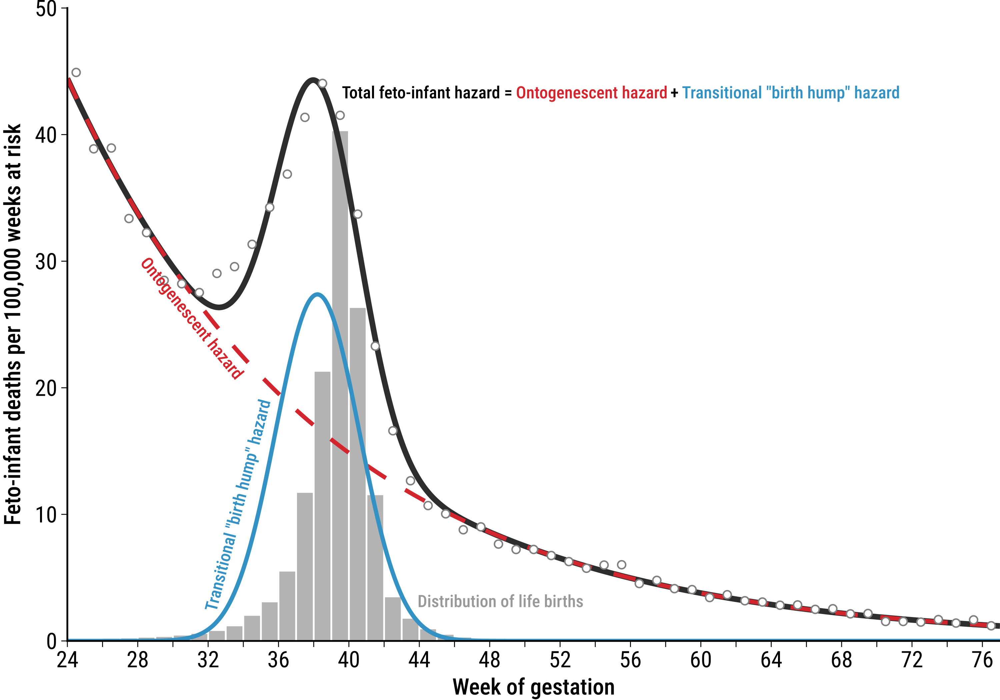

# The birth-hump – a shape decomposition of perinatal excess mortality

Jonas Schöley [](https://orcid.org/0000-0002-3340-8518) & Maxi S. Kniffka [](https://orcid.org/0000-0001-6603-2724)



We characterize the mortality pattern over gestational age for a cohort of fetuses in the U.S. from fetal viability through the transition of birth into infancy. This transition leaves a mark on the mortality trajectory visible as a "birth hump", a temporary increase in the risk of either fetal or infant death centered around an age of 38 weeks of gestation. This birth hump emerges in contrast to an exponentially declining baseline risk of feto-infant death over the 52 weeks following fetal viability, the "ontogenescent hazard". Using competing risks survival analysis, we exploit this pattern to quantify the risk of death contributed by the birth transition itself. We use U.S. population register data on births, fetal, and infant deaths for conception cohorts 1989, 1999, 2009, and 2014 to calculate multi decrement feto-infant life tables by cause of death. We perform stratified analyses by cohort, origin of mother, education of mother, and sex of the fetus/infant. Our results show the increasing importance of the birth transition itself as a contributor to overall feto-infant loss with up to 30.8% of all feto-infant deaths in the year following fetal viability being associated with the transition of birth. A analysis of perinatal population dynamics shows that the birth hump emerges as a direct result of the feto-neonate transition. The cause of death analysis revealed a unique composition of the birth hump with PCM complications, congenital malformations and maternal conditions, jointly contributing more than 60% to the hump. The ontogenescent-transitional view of feto-infant mortality reveals continuities bridging pre- and post-natal death while explicitly accounting for the discontinuity of birth.

## Repository structure

- `src/`: numbered R scripts and helper functions for data preparation, model fitting, inference, decomposition, and plotting.
- `cfg/`: codebooks and analysis configuration, including source URLs and fixed-width file layouts for the NCHS files.
- `dat/`: input data. The cause-of-death lookup table is tracked in `dat/10-cod-list/cod.csv`; raw NCHS downloads are stored in ignored subdirectories.
- `tmp/`: generated intermediate analysis objects.
- `out/`: generated analysis outputs, including life tables, model objects, tables, and SVG figures.
- `fig/`: publication-ready figure exports derived from generated outputs.
- `ass/`: repository assets such as the cover image.
- `doc/`: bibliography and manuscript-related files.

## Data

The analysis uses public-use data from the U.S. National Center for Health Statistics (NCHS):

- Cohort linked birth / infant death data, described in `cfg/codebook-us_cohort_infant_births_deaths_minimal.yaml`.
- Fetal death public-use files, described in `cfg/codebook-us_fetal_deaths_minimal.yaml`.

Raw NCHS files are not tracked by git. They are downloaded into:

- `dat/10-nchs-us_cohort_linked_infant_deaths_births/`
- `dat/10-nchs-us_fetal_deaths/`

## Computing environment

The analysis is run from the command line with GNU Make. It requires a recent R installation plus the packages listed in `src/_install_dependencies.R`. Install or refresh the R dependencies with:

```sh
Rscript --vanilla src/_install_dependencies.R
```

## Reproduce the analysis

If the raw NCHS files are not already present locally, download them first:

```sh
make download
```

Then rebuild all generated analysis outputs:

```sh
make all
```

## Pipeline overview

The Makefile captures the analysis flow:

1. `src/10-download_nchs_data_on_us_births_fetal_and_infant_deaths.R` downloads public NCHS input files using URLs from the YAML codebooks.
2. `src/20-prepare_us_fetoinfants.R` reads and harmonizes raw fetal death and linked birth / infant death files.
3. `src/21-derive_research_microdata.R` derives the research microdata and feto-infant transition records.
4. `src/30-fetoinfant_life_table_aggregation.R` aggregates transition records into feto-infant life tables.
5. `src/40-life_table_decomposition_analysis.R` performs life-table decomposition and produces supporting figures.
6. `src/50-fit_competing_risks_model.R` fits the competing-risks parametric survival models.
7. `src/51-*` through `src/56-*` combine fits, estimate statistics, and produce parameter and decomposition tables.
8. `src/60-*` through `src/63-*` generate the main hazard and cause-of-death figures.

## Outputs

Main generated artifacts are written to `out/`:

- `out/30-fetoinfant_lifetables.qs`: aggregated feto-infant life tables.
- `tmp/50-*` and `tmp/51-*`: competing-risks model fits and related intermediates.
- `out/31-*`, `out/52-*`, `out/53-*`, and `out/54-*`: descriptive, parameter, inference, and decomposition tables.
- `out/40-*`, `out/55-*`, `out/56-*`, and `out/60-*` through `out/63-*`: generated SVG figures and figure data objects.

Publication-ready PDF, PNG, and SVG figure exports are stored in `fig/`.
